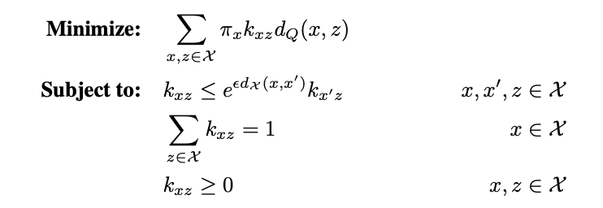

# GeoPrivacy

This is a python package for implementing geo-indistinguishability privacy mechanism. The methods can be applied to various location privacy tasks. So far, we implemented two privacy mechanisms for the sporadic case as described in the paper **[Geo-indistinguishability: A Principled Approach to Location Privacy](https://hal.inria.fr/hal-01114241/document)**.
In the exemple notebook, we demonstrated the mechanisms using NYC taxi trip data for sporadic case.

## Installation
Please run the following command in terminal to install the package and other dependencies.
```
$ pip install GeoPrivacy==0.0.2
```

## Example Usage
To generate a random laplace noise and add it to a location:
```python
from GeoPrivacy.mechanism import random_laplace_noise
eps = 0.1
location = (3, 5)
noise = random_laplace_noise(eps)
new_location = location + noise
```
Given a list of representative locations and their corresponding weights, you can use the geo-indistinguishable mechanism of optimal utility as following:
```python
from GeoPrivacy import mechanism, metrics
x_list = [(1, 2), (3, 2), (4, 1)]
pi_list = [3, 2, 5]
dQ = metrics.euclidean
epsilon = 0.5

p_matrix, pre_prob, post_prob = optql(x_list, pi_list, dQ, epsilon=0.5)
```
For more examples, please see **[example.ipynb](https://github.com/quao627/GeoPrivacy/blob/main/example.ipynb)**. Other information can be found in the docstring.

## Theory
The planar laplace mechanism can be used to add laplace noise to any given 2d-coordinates. It's worth noting that polar coordinates are used to generate random laplace noise. In order to randomly draw r, we use the inverse CDF of r which is 

as calculated in https://hal.inria.fr/hal-01114241/file/paper.pdf.

The optimal utility mechanism divides the region of interest into subregions and builds a linear program using representative points chosen from each subregion. Then, by solving the linear program, a stochastic transition matrix is obtained which can be used to transform any other data from the same region. The linear program takes the following form:

